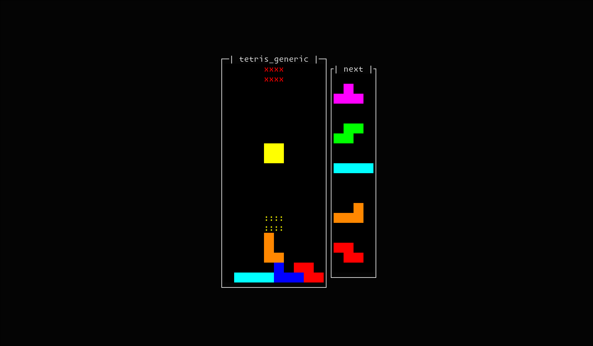

# tetris_generic

I wanna make some extensible tetris game



It just a simple terminal tetris game; GUI runner may will add

Hold feature not yet implemented

requires python >= 3.14

# installation

```shell
python3 -m pip install git+https://github.com/ityeri/tetris_generic.git
```

# run

terminal tetris
```shell
tgt
```
or
```shell
python3 -m tetris_generic.runners.terminal_runner
```

arguments
```shell
tgt -w 10 -v 22 -i 0.5 -q 5
```
```shell
tgt --width 10 --height 22 --interval 0.5 --que-length 5
```

* `-w` `--width`: Width of gamespace
* `-v` `--height`: Height of gamespace (`-v` means "vertical". `-h` is help option)
* `-i` `--interval`: Interval of each tick (seconds, can be float)
* `-q` `--que-length`: Length of next tetrominos que

# keys

* Move left falling piece: A, Left key, H
* Move right falling piece: D, Right key, L

* Rotate clockwise: W, Up key, K
* Rotate counterclockwise: Z, I

* Soft drop: S, Down key, J
* Hard drop: Space key, Enter key